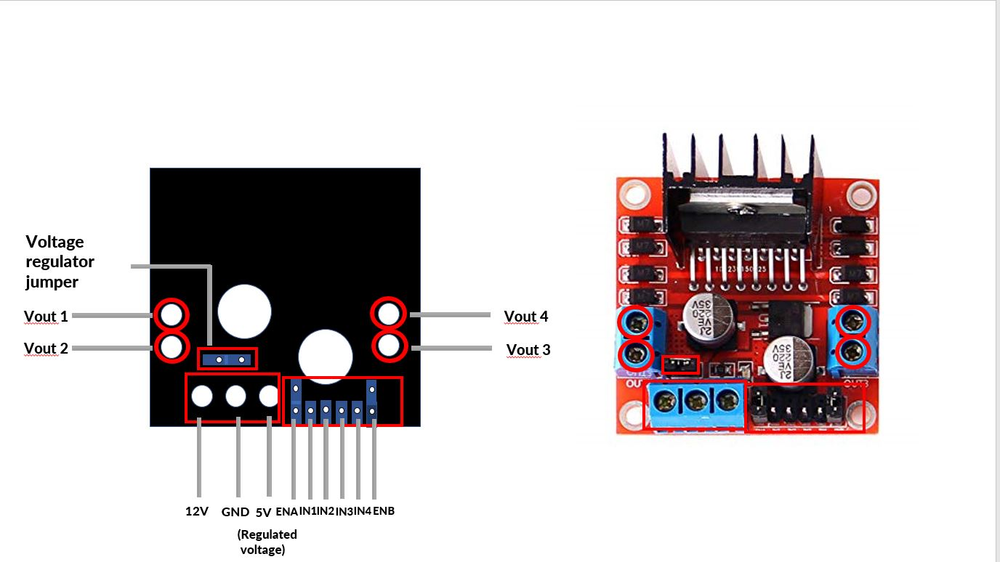
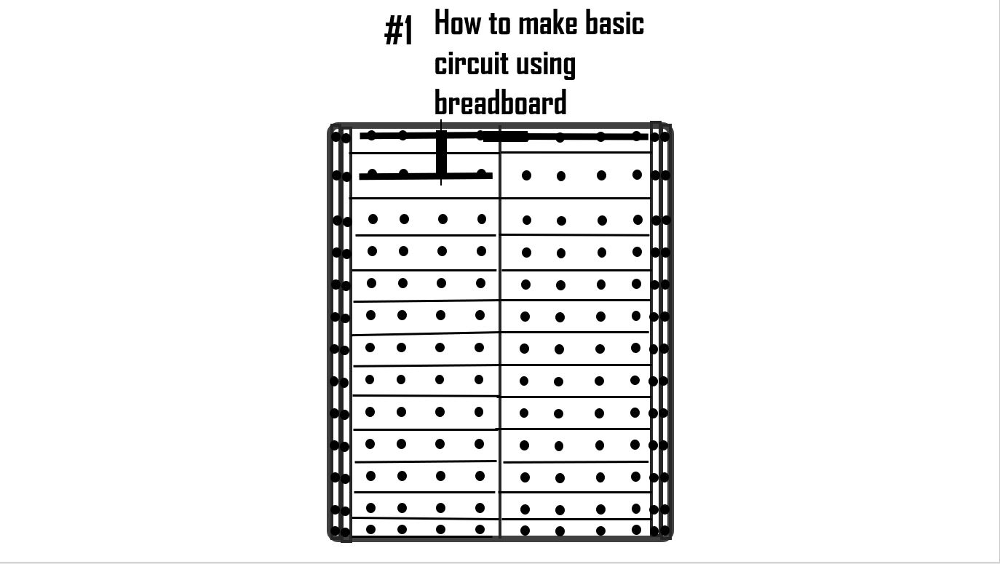
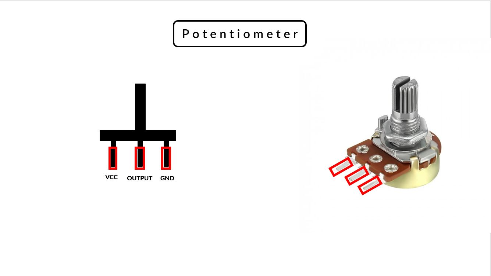

# RoboSUST Mentor Workshop 2020

This is the powerpoint files used in `RoboSUST Mentors Workshop 2020` Organized by RoboSUST . 

Please Download and Install `Open-Sans` and `Inconsolata` FONT.

## Motor Driver 

**This file contains material to teach Motor Driver (L298N) with animations**

## Breadboard 

**This file contains material to teach breadboard with animations**

## Potentiometer 

**This file contains material to teach potentiometer with animations**

